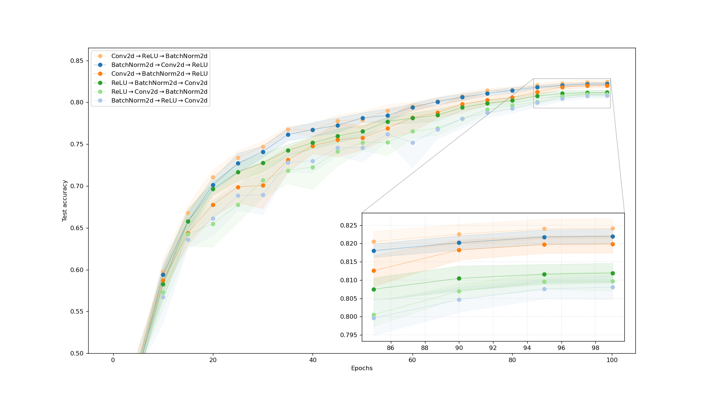
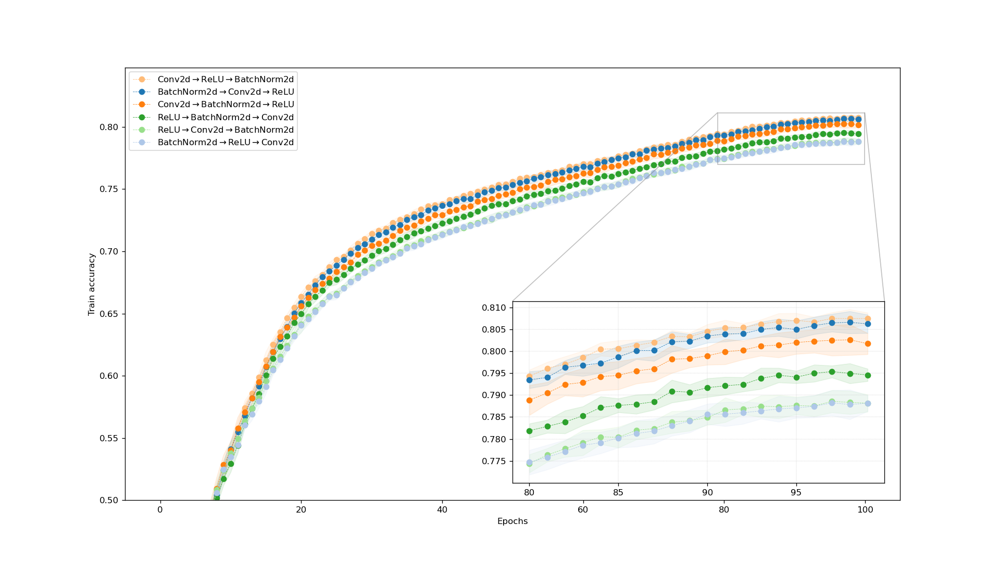

# NeuralNetworkLayerOrder

Experiments to evaluate the effect of different orders of layers in neural networks.

## Convolutional Neural Network 

### Network

Isotropic convolutional neural network consisting of 4 blocks with shape `channels x height x width`. 
Number of channels were set to 32. Height and width were equal to the input of the selected dataset.

Each block was composed of the following layers:

- BatchNorm2d
- Conv2d 
- ReLU

### Experimental Setup

- Adam optimizer
- Epochs: 100
- One cycle learning rate: 
  - initial_lr: 1e-5
  - max_lr: 4e-3
  - min_lr: 1e-7
- Batch size: 1024

### Results

#### Cifar10

Test accuracy for different layer configurations and datasets averaged over 12 runs.

| Layer configuration           | Test accuracy  |
|-------------------------------|----------------|
| BatchNorm2d -> Conv2d -> ReLU | 0.793 +- 0.004 |
| Conv2d -> ReLU -> BatchNorm2d | 0.793 +- 0.003 |
| Conv2d -> BatchNorm2d -> ReLU | 0.790 +- 0.004 |
| ReLU -> BatchNorm2d -> Conv2d | 0.785 +- 0.003 |
| ReLU -> Conv2d -> BatchNorm2d | 0.780 +- 0.004 |
| BatchNorm2d -> ReLU -> Conv2d | 0.779 +- 0.002 |

| Layer configuration           | Train accuracy |
|-------------------------------|----------------|
| Conv2d -> ReLU -> BatchNorm2d | 0.767 +- 0.002 |
| BatchNorm2d -> Conv2d -> ReLU | 0.766 +- 0.002 |
| Conv2d -> BatchNorm2d -> ReLU | 0.762 +- 0.004 |
| ReLU -> BatchNorm2d -> Conv2d | 0.757 +- 0.003 |
| ReLU -> Conv2d -> BatchNorm2d | 0.748 +- 0.003 |
| BatchNorm2d -> ReLU -> Conv2d | 0.747 +- 0.002 |

